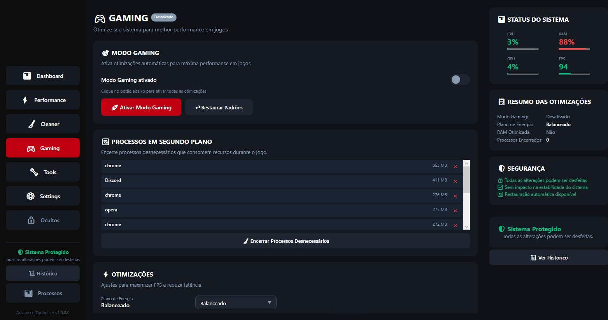
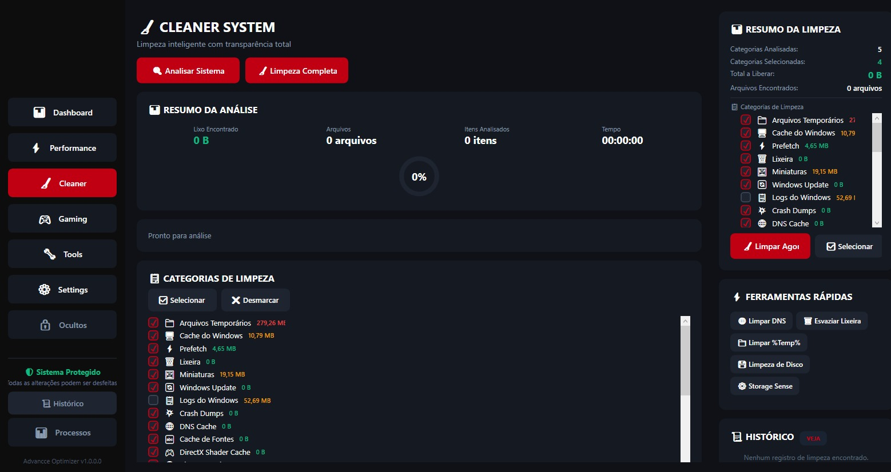
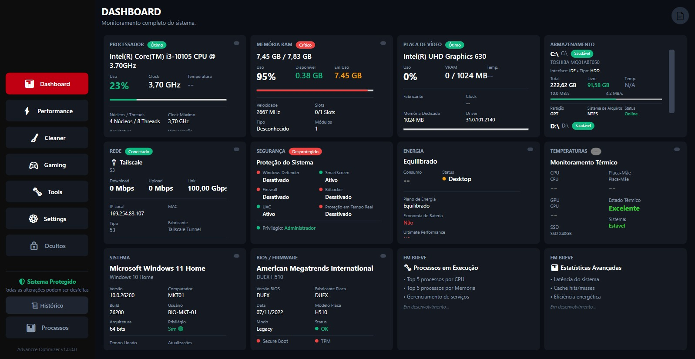

<h1 align="center">👋 Olá, eu sou o Isaac Maciel</h1>
<h3 align="center">Desenvolvedor Back-End | C# .NET | Java | Automação & Dados</h3>

---

## 🚀 Sobre mim

Sou desenvolvedor Back-End com **projetos em produção utilizando C#/.NET Core** e sólida formação em **Java/Spring Boot**.

Trabalho diariamente integrando **tecnologia, automação e análise de dados** para entregar soluções reais — desde APIs REST e aplicações desktop até dashboards e fluxos automatizados com n8n.

Minha missão: criar soluções funcionais, escaláveis e inteligentes — seja em **código, dados ou automações**. Tecnologia é meu meio, melhoria contínua é meu objetivo.

---

## 📫 Onde me encontrar

---

## 🛠️ Tecnologias e Ferramentas

### 🚀 Back-End (Produção)

### ☕ Back-End (Formação Sólida)

### 🗄️ Banco de Dados

### 🎨 Frontend (Apoio)

### 🐳 DevOps & Infraestrutura

### 🤖 Automação & Integração

### 📊 Business Intelligence

### 🛠️ Ferramentas

---

## 📌 Projetos em Destaque

### 🚀 AdvancceHub
*Plataforma para desenvolvedores iniciantes estruturarem sua carreira*

- **Linguagem:** C#
- **Framework:** .NET / WPF
- **Interface:** WPF + XAML
- **Banco de Dados:** PostgreSQL
- **Versionamento:** Git / GitHub---

### 🖥️ Advancce Optimizer
*Aplicação desktop para otimização de sistema e automação de rotinas*

## 📸 Screenshots

### 🖥️ Dashboard

Monitoramento completo do sistema, incluindo CPU, RAM, GPU, armazenamento, rede, segurança e informações do sistema.

  

---

### 🧹 Cleaner System

Sistema de análise e limpeza de arquivos temporários, caches, logs e outros arquivos desnecessários.

  

---

### 🎮 Gaming Mode

Modo dedicado para otimização do sistema durante jogos, gerenciamento de processos e ajustes de desempenho.

  

---

## 📊 Estatísticas do GitHub

  
  

---

## 🎯 O que estou estudando no momento

🎯 **Objetivo:** Criar meu primeiro microsserviço em Java/Spring Boot para integrar com o AdvancceHub

---

## 📫 Vamos conversar?

Estou aberto a oportunidades como **Desenvolvedor Back-End Júnior** e também a colaborações em projetos open-source.

---

⭐ **"Todo desenvolvedor sênior já foi um iniciante perdido. O AdvancceHub é o farol que eu gostaria de ter tido!"**
](https://isaacspace.netlify.app/)
